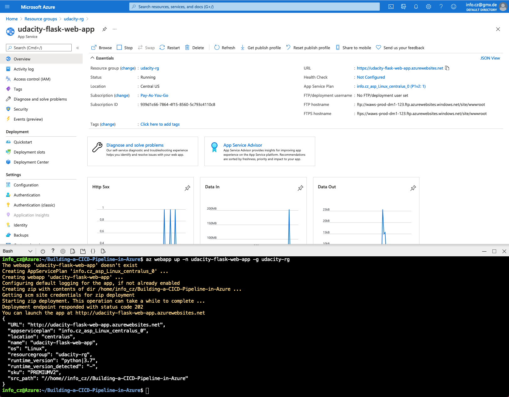

# Building a CI/CD Pipeline in Azure

* [Overview](#overview)
* [Instructions](#instructions)

## Overview
This project is part of the Udacity Cloud DevOps using Microsoft Azure Nanodegree Program.

The first part of this project can be found in the following [GitHub Repo](https://github.com/czofficial/Udacity-Cloud-DevOps-using-Microsoft-Azure-Nanodegree-Program/tree/master/C2-AgileDevelopmentwithAzure).

## Instructions
### Create GitHub Actions Workflow
1. Go to your GitHub Repo
2. Got to Actions
3. Go to 'New workflow' and 'set up a new workflow yourself'
4. Configure your YML file as such:
```
name: Python application test with Github Actions

on: [push]

jobs:
  build:

    runs-on: ubuntu-latest

    steps:
    - uses: actions/checkout@v2
    - name: Set up Python 3.5
      uses: actions/setup-python@v1
      with:
        python-version: 3.5
    - name: Install dependencies
      run: |
        make install
    - name: Lint with pylint
      run: |
        make lint
    - name: Test with pytest
      run: |
        make test
```
5. Verify your successfull run in 'All Workflows'

A prerequisite for having a successfull CI workflow in GitHub Actions is a 'Makefile' and a 'requirements.txt'. In this project, I will only use pylint for code testing, not pytest. In the requirements file, you need to state the python libraries that are needed to get the Flask web app running. With this in place, a new push to the GitHub repo will automatically trigger the CI workflow in GitHub Actions (testing the app.py file). A pylint score below 10 will result in a failed CI build. That's the sign to refactor your code according to the pylint standards.

There's also a GitHub Action badge showing the current status of the project:
[](https://github.com/czofficial/Building-a-CICD-Pipeline-in-Azure/actions/workflows/python-app.yml)

### Deploy the Flask Web App in Azure Cloud Shell
1. Launch an Azure Cloud Shell Environment, create ssh keys and upload them into your GitHub account.
````
ssh-keygen -t rsa
````
2. Clone the GitHub project into your Azure Cloud Shell environment.
````
git clone git@github.com:czofficial/Building-a-CICD-Pipeline-in-Azure.git
````
3. CD into your project directory and create the Python virtual environment via the Makefile.
```
make setup
```
4. Activate the Python virtual environment.
```
source ~/.udacity-devops/bin/activate
```
5. Install dependencies (pip & requirements) in the Python virtual environment and run CI part (only linting).
```
make all
```
6. Start Flask web app
```
python app.py
```
7. Open second Azure Cloud Shell terminal and test the app by making a prediction
```
./make_prediction.sh
```

Successfull output:


### Deploy the Flask Web App to Azure App Service
1. Create an Azure App Service in your Azure Cloud Shell environment
```
az webapp up -n udacity-flask-web-app -g udacity-rg
```
Once, this step is successfully done, you should see the Azure App Service in your resource group (Status: running).



2. Create a new project in Azure DevOps
3. Create a new service connection in Azure DevOps (you can find it under project settings). The Azure Resource Manager comes in handy for that. Choose Service principal (automatic) if asked and establish a connection to your subscription and resource group.
4. Go to Azure DevOps Pipelines and create one by connecting it to your GitHub repo. Once, you can configure your pipeline, choose 'Python to Linux Web App on Azure'. This will generate the appropriate YML file for the Flask web app.\
Once, this step is successfully done, you have deployed the Flask Web App.


5. Test the Flask Web App
```
./make_predict_azure_app.sh 
```

The output should look like this:


6. Logs can be found here:
```
az webapp log tail -n udacity-flask-web-app -g udacity-rg
```

The output should look like this:


## Enhancements
One of the enhancements you can do is setting up the whole CI/CD workflow in Azure DevOps Repo & Azure DevOps Pipelines alone, leaving out GitHub and GitHub Actions completely. Personally, I found it a bit confusing doing the CI part in GitHub (Actions) and the CD part in Azure DevOps (Pipelines).